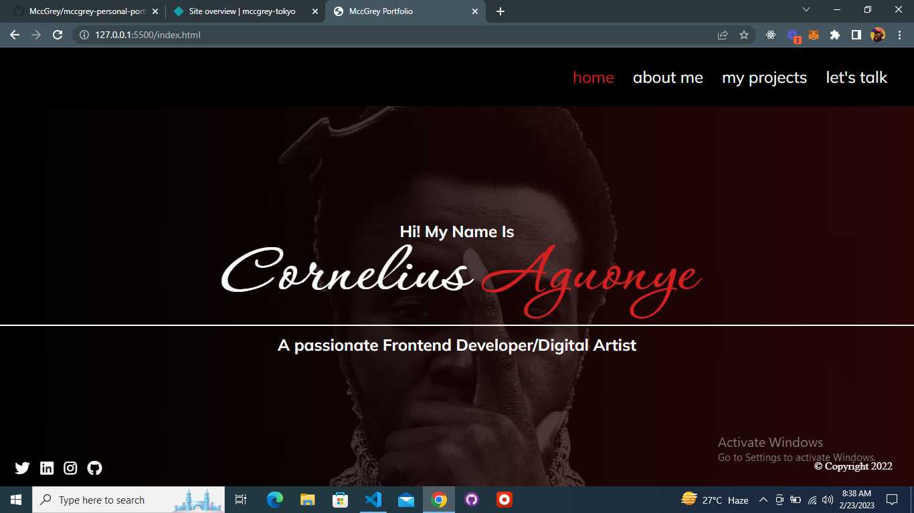
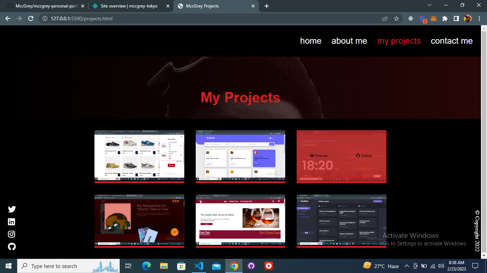

## About web-app

my personal portfolio

## Table of contents

- [Overview](#overview)
  - [The challenge](#the-challenge)
  - [Links](#links)
  - [Built with](#built-with)
- [Author](#author)

## Overview

### The challenge

Users should be able to:

- Work with sass
- Responsive design

### Links

- Live Site URL: [MccGrey-portfolio](https://mccgrey-portfolio.netlify.app/)

### Built with

- Semantic HTML5 markup
- CSS custom properties
- Mobile-first workflow
- [SASS](https://sass.com/) - For styles

## Author

### AGUONYE CORNELIUS (MCCGREY)

- LinkedIn - [@mccgrey](https://www.linkedin.com/in/mccgrey)
- Twitter - [@browncheese6](https://www.twitter.com/browncheese6)
- Github - [@MccGrey](https://github.com/MccGrey)
